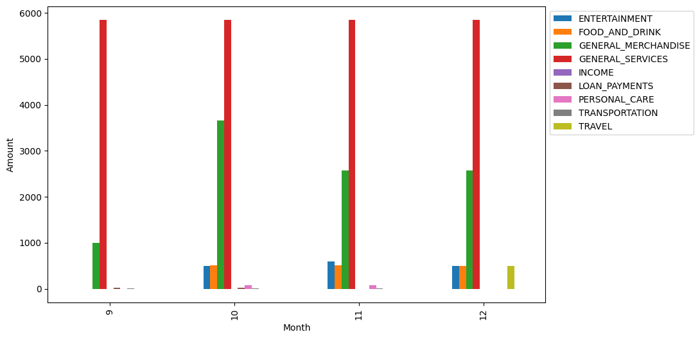
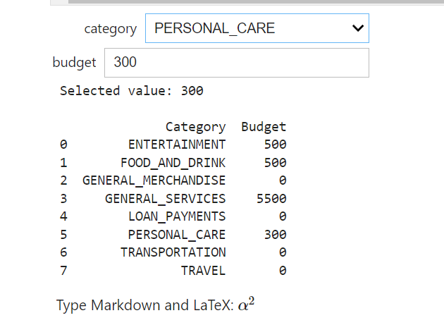
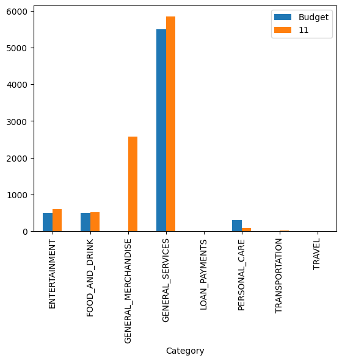

BudgetBuddy💰📊
===
## Project Inspiration

I embarked on this project with the interest of myself in financial planning tools as well as my enthusiasm for **HSBC**. As I have noticed, while HSBC UK mobile app featured transaction categorization, I noticed the absence of a similar feature in apps from my home region, Malaysia, and also in Singapore HSBC app.

The inspiration for this project stemmed from the belief that transaction categorization is crucial for effective financial planning. Even for myself, I downloaded a financial insight app, [Spendee](https://www.spendee.com/), to track my spending habits, and I loved it so much that it inspired the creation of BudgetBuddy.
## Project Description:

In this project, I have made a *transaction categorisation* on the transaction data taken from [Plaid API](https://plaid.com/docs/api/). In addition to that, I have also implemented
a *budget setter* to set a budget on different categories and compare the budget with actual spendings.

## Project Overview:
### Transaction Categorisation

- The transaction data was fetched from Plaid API, and I have categorized them based on their detailed category and month of transaction, and finally plot them in a bar chart as below.
- The list of categories is based on the data, it can be adjusted based on own preference.

- Below here is a snippet of my code for categorisation part:

<div style="display: flex; flex-wrap: wrap; justify-content: space-between; align-items: flex-start;">

  <!-- Left Column: Code -->
  <div style="flex: 1; margin-right: 20px;">
    
```python
# Categorisation
import pandas as pd
import datetime
%run transaction_data.py

df = pd.json_normalize(data)
df['date'] = pd.to_datetime(df['date'])
df=df[['amount','personal_finance_category.primary','personal_finance_category.detailed','date']]

# group by month and category
monthly_flow=df.groupby([df['date'].dt.month, 'personal_finance_category.primary'])['amount'].sum().unstack()
monthly_flow = monthly_flow.rename_axis(columns='Category')

display(monthly_flow)
monthly_flow.plot(kind='bar', legend=True, 
                  figsize=(10, 6),
                  ylabel='Amount',
                  xlabel='Month',
                ).legend(bbox_to_anchor=(1.0, 1.0))
```

  </div>

  <!-- Right Column: Screenshot -->
  
  
</div>

### A Budget setter
- A budget setter on different categories is also implemented to compare the budget with actual spendings
- The budget setter is implemented by using [Jupyter Widgets](https://ipywidgets.readthedocs.io/en/stable/examples/Widget%20List.html)

 

### Monthly overview with budget
- Pick a month to view a bar chart of monthly spendings with set budgets on different categories 
- This bar chart can be useful for further financial planning 




## Built Using:
<table>
  <tr>
    <th><b>Purpose</b></th>
    <th><b>Technology</b></th>
  </tr>

  <tr>
    <td align="center">Notebook Environment</td>
    <td>
      
    </td>
  </tr>

  <tr>
    <td align="center">Programming Language</td>
    <td>
      
    </td>
  </tr>

  <tr>
    <td align="center">Data Manipulation and Visualisation</td>
    <td>
      
    </td>
  </tr>

  <tr>
    <td align="center">Version Control and Code Hosting</td>
    <td>
      
    </td>
  </tr>
</table>


For a detailed code, see [myGitHubRepo](https://github.com/LynetteLeeSiYing/BudgetBuddy.git) 

Thanks for Reading! 🚀 